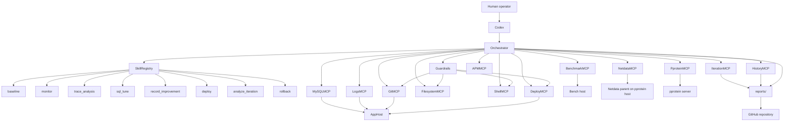
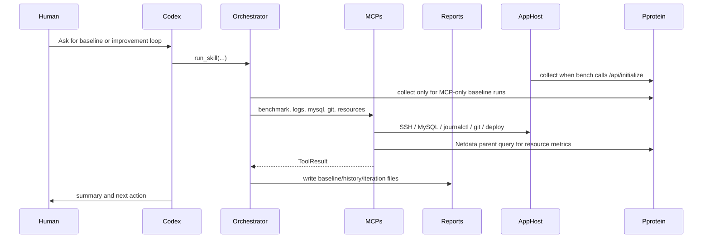

# ISUCON AI Tools Architecture

Last updated: 2026-09-22

This document is the map of the current Codex/agent-side architecture. Update it whenever Skills, MCPs, or external observability flows change.

Operational agent roles and handoff rules are defined in `AGENTS.md`.
This architecture document explains the coded automation layer; `AGENTS.md` explains how Codex should use role-specific agents during improvement loops.

## Overview

## Skill Flow

## Operational Agents

The current coded layer is `Orchestrator + Skill + MCP`.
For serious optimization loops, Codex should also follow the role-based workflow in `AGENTS.md`.

Default roles:

- Profiler Agent
- App Understanding Agent
- SQL Agent
- Implementer Agent
- Verifier Agent
- Recorder Agent

Iteration reports should record which of these agents were used and what they concluded.

## Skills

| Skill | Purpose | Main MCPs |
| --- | --- | --- |
| `baseline` | Run or record benchmark state and collect current system state. | `BenchmarkMCP`, `MySQLMCP`, `LogsMCP`, `GitMCP`, `NetdataMCP`, `PproteinMCP` |
| `monitor` | Collect resource and APM-style telemetry. | `NetdataMCP`, `APMMCP` |
| `trace_analysis` | Summarize traces and DB hotspots. Currently APM data is mock-like. | `APMMCP`, `MySQLMCP` |
| `sql_tune` | Inspect slow queries and SQL/index candidates. | `MySQLMCP`, `LogsMCP` |
| `record_improvement` | Persist hypothesis, evidence, score delta, reports, and commit. | `HistoryMCP` |
| `deploy` | Run deploy command, preflight, health checks, and failure log collection. | `DeployMCP`, `GitMCP`, `ShellMCP` |
| `analyze_iteration` | Compare before/after reports and suggest next bottleneck area. | `IterationMCP` |
| `rollback` | Placeholder for explicit rollback workflows. | `GitMCP`, `FilesystemMCP`, `ShellMCP`, `HistoryMCP` |

## MCPs

| MCP | Current Role | Notes |
| --- | --- | --- |
| `BenchmarkMCP` | Runs the ISUCON benchmark on the bench host and parses score/pass/error counts. | Real SSH-backed path exists. |
| `NetdataMCP` | Queries per-host resource metrics (CPU, load, memory, disk IO) from the Netdata parent on the pprotein host. | All instances stream to that parent (`isucon_ansible/roles/general`); no per-host SSH needed. Falls back to mock data when `netdata.parent` is absent from config. |
| `MySQLMCP` | Reads slow query log, EXPLAINs queries, and checks processlist. | SSH-backed `sudo mysql` flow. |
| `LogsMCP` | Reads recent journal logs and summarizes Nginx LTSV routes. | Used in baseline reports. |
| `GitMCP` | Reads status/diff and guarded restore. | Guardrails enforce repo path and restore path constraints. |
| `FilesystemMCP` | Guarded local file writes with backup. | Used for safe file operations inside allowlist. |
| `ShellMCP` | Guarded local shell command execution. | Denies configured dangerous commands. |
| `DeployMCP` | Runs preflight, deploy command, service health checks, and failure log collection. | Full deploy requires clean git unless `allow_dirty=True`. |
| `IterationMCP` | Compares benchmark reports and generates iteration reports. | Outputs Markdown under `reports/iterations/`. |
| `PproteinMCP` | Integrates shared observability collection/dashboard links. | Current practice default is initialize hook mode; the app triggers pprotein when bench calls `/api/initialize`. |
| `APMMCP` | Placeholder APM data provider. | Real route latency currently comes from Nginx logs, not APM. |
| `HistoryMCP` | Persists improvement records and Markdown summaries. | Stores JSONL and Markdown under `reports/`. |

## External Systems

| System | Role |
| --- | --- |
| App host `s1` | Runs the ISUCON app, Nginx, and the git repo. No longer runs MySQL (split to `s2`). |
| DB host `s2` | Dedicated MySQL host, split from `s1` for CPU resource reasons; only `mysql.service` runs here. |
| Bench host `s3` | Runs the official/practice benchmark command. |
| pprotein host `s3` | Shared dashboard for pprof, httplog, slowlog, and future human/agent collaboration. It is not exposed publicly; use SSH tunnel `localhost:9000`. |
| Netdata parent (pprotein host `s3`) | Receives streamed metrics from every instance; single place to query per-host CPU/load/memory/disk. Not exposed publicly; use SSH tunnel to `localhost:19999`. |
| GitHub repo | Shared source, deploy state, docs, reports, and decision history. |

(Role mapping current as of the 2026-09-23 environment recreation, which swapped `s2`/`s3` from an earlier `s1`+`s3` load-targeted / `s2` bench arrangement — see `reports/summary/isucon14.md` and `docs/environment-teardown-restore.md`. Check `config/isucon14.yaml` if this looks out of date.)

## Benchmark Collection Policy

- The primary trigger is the Go application's `POST /api/initialize` handler.
- The handler starts pprotein collection asynchronously and best-effort.
- This applies to both human-run and Codex-run benchmarks because both go through bench initialization.
- `PproteinMCP.collect()` remains available for MCP-only baseline runs that do not exercise `/api/initialize`.

## Update Rule

Update this file when any of these change:

- A Skill is added, removed, renamed, or changes its main MCPs.
- An MCP is added, removed, renamed, or changes from mock to real behavior.
- Guardrails start protecting a new operation type.
- pprotein/manual/agent collection flow changes.
- Operational agent roles or handoff rules in `AGENTS.md` change.
- Reports move location or change schema.
